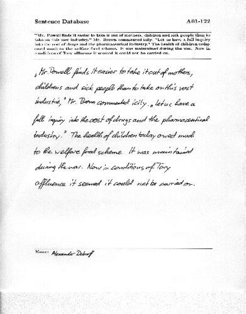
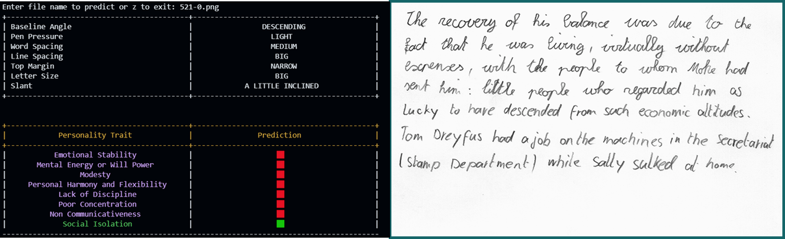
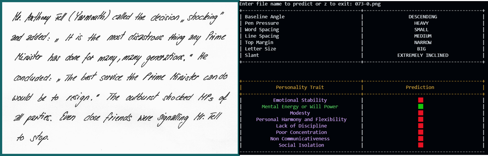

# HBPA: A Machine Learning Approach to Handwriting-Based Psychological Assessment

## Overview

This project automates graphological analysis using machine learning to predict personality traits from handwriting. It processes handwritten images, extracts relevant features, and applies machine learning models to determine psychological attributes.

## Table of Contents

- [Installation](#installation)
- [Usage](#usage)
- [Dataset](#dataset)
- [Features](#features)
- [Results](#results)
- [Future Scope](#future-scope)
- [Contributing](#contributing)
- [License](#license)

## Installation

1. Clone the repository:
   ```bash
   git clone https://github.com/yourusername/handwriting-analysis.git
   ```
2. Navigate to the project directory:
   ```bash
   cd HBPA
   ```
3. Install the required packages:
   ```bash
   pip install -r requirements.txt
   ```

## Usage

1. Ensure your handwriting samples are in the `data/samples` directory.
2. Run the analysis script:
   ```bash
   python train_predict_v3.py
   ```
3. The results will be displayed in the terminal.
## Dataset

### Data Acquisition

Data obtained from the IAM Handwriting Database of Research Group on Computer Vision and Artificial Intelligence, INF University of Bern, Switzerland.

- Contains 1538 pages of scanned text.
- 657 writers contributed samples of their handwriting.
- Each handwriting sample is labeled with corresponding psychological traits by manually studying each document.
- [Dataset URL](https://fki.tic.heia-fr.ch/databases/download-the-iam-handwriting-database)

  
  *Sample data from IAM Handwriting Database*


### Image Processing

- Images are cropped and saved as PNG images with an automatic action script.
- The width of all the images is 850 pixels, and the height varies according to the content of the handwriting in the image.
  
  *Data sample after image processing*

## Features

### Pre-Processing
- Resolution enhancement
- Noise reduction
- Grayscale conversion
- Contour detection
- Warp affine transformation
- Horizontal and vertical projections

### Feature Extraction
- Baseline
- Top margin
- Letter size
- Line spacing
- Word spacing
- Pen pressure
- Slant angle

### Personality Traits
The system predicts eight key psychological attributes:
- Emotional Stability
- Mental Energy or Will Power
- Modesty
- Personal Harmony and Flexibility
- Lack of Discipline
- Poor Concentration
- Non-communicativeness
- Social Isolation

## Results

Screenshots of actual terminal output of the model along with it's respective handwriting sample:


*Output 1*


*output 2*
## Future Scope

### Development of a User Interface (UI)
- Aim to design and implement an intuitive UI that facilitates easy access for the general public, enabling them to utilize the handwriting biometrics system effectively.

### Integration of Convolutional Neural Networks (CNN)
- Transition from using Support Vector Machines (SVM) to employing CNNs for direct handwriting analysis, leveraging their advanced pattern recognition capabilities to enhance the system’s accuracy.

### Optimization of Model Performance
- Focus on reducing the model’s execution time without compromising accuracy, ensuring a more efficient and responsive system for real-time applications.

## Contributing

1. Fork the repository.
2. Create a new branch:
   ```bash
   git checkout -b feature-branch
   ```
3. Make your changes and commit them:
   ```bash
   git commit -m "Add new feature"
   ```
4. Push to the branch:
   ```bash
   git push origin feature-branch
   ```
5. Open a pull request.

## License

This project is licensed under the MIT License - see the [LICENSE](LICENSE) file for details.
